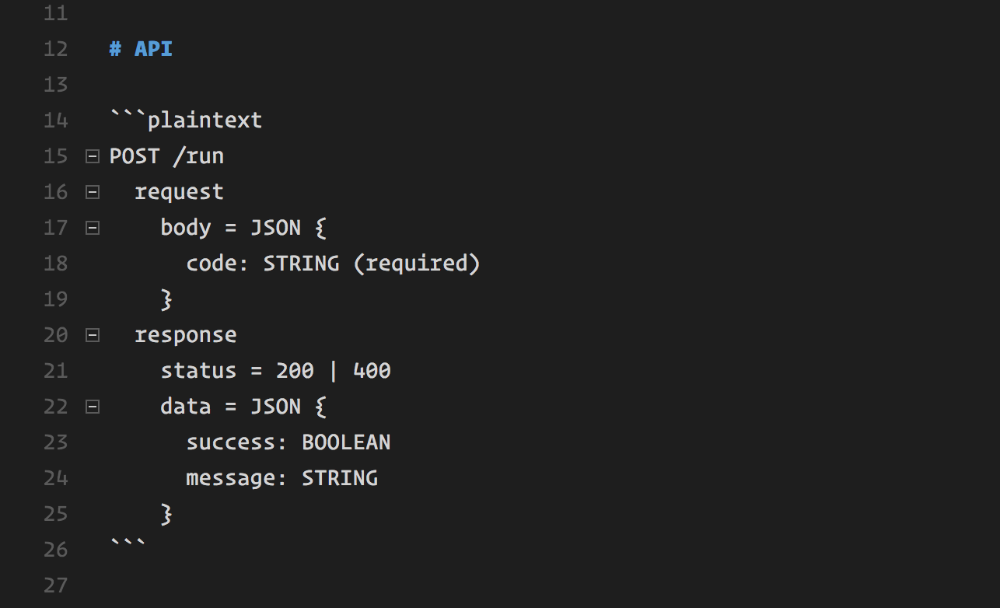

# Contributing to Documentation

As features are added, APIs and endpoints will be exposed by the various servers/services.

Be sure to commit changes to the documentation when such changes occur to the codebase. Follow these guidelines for specific documentation syntax:

* [Conventions](#conventions)
* [REST API Endpoints](#rest-api-endpoints)
* [Websocket Event](#websocket-event)

## Conventions

Be sure to use \`\`\`plaintext above and below a code block of plaintext in your markdown when denoting information about an API endpoint. It looks like this:



## REST API Endpoints

```plaintext
[METHOD] [/endpoint/path]
  request
    body = JSON {
      [property1]: [TYPE] [(required)]
      [property2]: [TYPE]
    }
    query = {
      [key1] [(required)]
      [key2]
      [key3]
    }
  response
    status = [STATUS_CODE_1 | STATUS_CODE_2]
    data = JSON {
      [property1]: [TYPE]
      [property2]: [TYPE]
    }
```

Examples:

```plaintext
GET /slings
  request
    query = {
      search (required)
      page
      filterInactive
    }
  response
    status = 200 | 400 | 500
    data = JSON {
      success: BOOLEAN
      message: STRING
    }
```

```plaintext
POST /slings
  request
    body = JSON {
      text: STRING (required)
    }
  response
    status = 200 | 400 | 500
    data = JSON {
      success: BOOLEAN
      message: STRING
      slingId: NUMBER
    }
```

## Websocket Event

**[Event Name]**

[Description of when the event is triggered]

```plaintext
payload: {
  [key]: [TYPE]
}
```

Example:

client.update

Emit to the server when user has changed the state of the code editor

```plaintext
payload: {
  text: STRING
}
```
